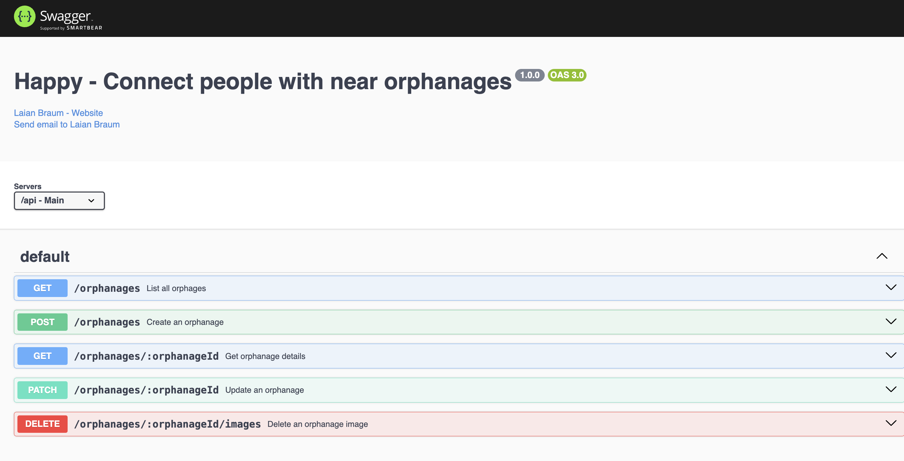

<h1 align="center">
    
</h1>

<h3 align="center">
  Happy - Make children's day happy
</h3>

<p align="center">
  <a href="https://www.linkedin.com/in/laianbraum/"></a>
  
  <a href="https://github.com/lzizn/happy-api-2024/commits/master"></a>
</p>

<p align="center">
  <a href="#-about">About the project</a>&nbsp;&nbsp;&nbsp;|&nbsp;&nbsp;&nbsp;
  <a href="#-technologies--concepts">Technologies</a>&nbsp;&nbsp;&nbsp;|&nbsp;&nbsp;&nbsp;
  <a href="#-getting-started">Getting started</a>&nbsp;&nbsp;&nbsp;|&nbsp;&nbsp;&nbsp;
</p>

## 🧸 About

Happy is an application that connects people to institutional care homes to make many children's day happier. It was originally developed in 2021.

This repository is a Clean Architecture 2024 version of [happy-api](https://github.com/lzizn/happy-api).

## 🚀 Technologies & Concepts

Technologies & Concepts used

- [Node.js](https://nodejs.org/en/)
- [TypeScript](https://www.typescriptlang.org/)
- [Express](https://expressjs.com)
- [zod](https://zod.dev/)
- [MongoDB](https://www.npmjs.com/package/mongodb)
- [AWS S3 SDK](https://www.npmjs.com/package/@aws-sdk/client-s3)
- [Swagger](https://www.npmjs.com/package/swagger-ui-express)
- [Clean Architecture](https://blog.cleancoder.com/uncle-bob/2012/08/13/the-clean-architecture.html)

## 💻 Getting started

### Requirements

- [Node.js](https://nodejs.org/en/)
- [MongoDB](https://www.npmjs.com/package/mongodb)
- Any package manager (pnpm, yarn npm)

```bash
$ git clone https://github.com/lzizn/happy-api-2024.git && cd happy-api-2024
```

**Follow the steps below**

```bash
# Starting from the project root folder, go to backend folder
# Install the dependencies
$ pnpm i

# To finish, run the api service
$ pnpm run dev

# Well done, project is started!
```

### API documentation

Upon running the server, an api documentation is available at http://localhost/api-docs


